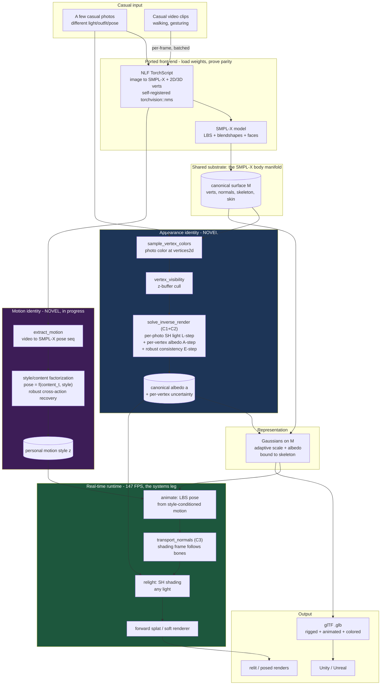

# NeuralCharGen — system architecture

**One-line:** casual photos + casual video → a hyperreal, **relightable**, **riggable**, **personally-animated**, game-engine-ready 3D avatar — built entirely in C++/CUDA (no Python at runtime), on novel, benchmarked math.

**The unifying principle (the thesis):** *personal identity — how you look and how you move — is the invariant latent that explains inconsistent casual observations across nuisance diversity.* Lighting diversity makes **appearance** (albedo) identifiable; action diversity makes **motion style** identifiable. One principle, two manifolds, one avatar.

---

## 1. System diagram



ASCII fallback (data flow):

```
casual photos ─┐                                    ┌─ albedo (relightable)  ──┐
               ├─► NLF ─► SMPL-X ─► body manifold ──┤                           ├─► Gaussians/mesh
casual video ──┘    (ported front-end)              └─ motion style (personal) ─┘        │
                                                                                          ▼
                                       animate(LBS) ─► transport normals(C3) ─► relight(SH) ─► splat
                                                                                          │  147 FPS
                                                                                          ▼
                                                                    glTF (.glb) ─► Unity / Unreal
```

---

## 2. Module map (`ncg-*`)

| Module | Role | Key pieces |
|---|---|---|
| `ncg-core` | tensor/CUDA/log helpers, custom-kernel pattern | error/cuda checks, saxpy golden |
| `ncg-io` | image, **safetensors**, WeightMap, **npy** | zero-copy mmap, parity harness |
| `ncg-body` | image→SMPL-X | **NLF** (TorchScript loader + self-registered `nms`), SMPL-X LBS forward, faces |
| `ncg-recon` | **the novel core** | appearance (sample/visibility/fusion), adaptive scale, **inverse_render (C1/C2 + SH + relight + C3 transport)** |
| `ncg-runtime` | renderers + camera | forward-splat CUDA kernel, differentiable `render_soft`, `solve_pinhole_camera` |
| `ncg-fit` | per-subject 3DGS | image/multi-view fit, **`refine_gaussians_to_image`** (camera-solved, masked) |
| `ncg-mesh` | mesh + export | marching cubes, normals, **glTF write (static / skinned / animated)** |
| `ncg-select` | bad-upload handling | sharpness + **`select_views`** (submodular coverage, leg #3) |
| `ncg-nerf` | NeRF leg + hybrid | TinyNerf, differentiable volume render, `composite_over` |
| `ncg-material`/`ncg-rig` | relight shader / rig export | analytical relight, OBJ+rig JSON |
| `ncg-record` | experiment recording | run dirs, metrics.jsonl, image dumps, timers, PSNR/SSIM/MAE |
| `apps/ncg_cli` | driver | `fit fuse delight relight export benchmark runtime nerf render turntable select` |
| `tools/` | DEV-only Python | `convert_smplx`, `dump_nlf`, **`extract_motion`**, `make_avatar.sh` |

---

## 3. The three+1 contributions (where the novelty lives)

| | Claim | Validated |
|---|---|---|
| **C1** | casual multi-illumination ⇒ albedo identifiable; diversity helps | benchmark: 0.096→0.024 |
| **C2** | robust estimator rejects inconsistent/junk observations | 0.031 vs 0.096 (7× at 50%) |
| **C3** | animate∘relight = relight∘animate (normal transport) | error 4.2e-7 |
| **comparison** | relighting vs NeRF/3DGS (they bake light) | 6.2× better |
| **C4 (new)** | cross-action ⇒ **motion style** identifiable + robust from casual video | *building now* |

Math + derivations: `docs/method.md`. Numbers + stats: `docs/benchmarks.md`.

---

## 4. End-to-end pipeline (commands)

```bash
# photos -> rigged, textured, animated avatar (Unity-ready), one command:
tools/make_avatar.sh front.jpg side.jpg --out me.glb

# pieces:
ncg_cli fit       --image me.jpg --weights nlf --smplx smplx --refine   # 3DGS refine
ncg_cli fuse      --images a,b,c ...                                     # cross-photo fusion
ncg_cli delight   --images a,b,c ...                                     # recover albedo + relight
ncg_cli relight   --smplx smplx                                         # orbiting-light relight
ncg_cli export    --image me.jpg --weights nlf --smplx smplx --animate  # rigged+idle glTF
ncg_cli runtime   --smplx smplx [--motion m.npy]                        # 147 FPS animate+relight
ncg_cli benchmark --smplx smplx --seeds 5                               # paper figures
tools/extract_motion.py --frames dir --out m.npy                        # video -> SMPL-X motion
```

---

## 5. Hardware / dev loop

Author on Mac (no CUDA) → push → build/run on **Jetstream2 H100 (sm_90)** → results back.
LibTorch = the torch 2.6 wheel (pre-cxx11-ABI). Full test suite: **49 green, 2 design-skips**.
Build-blind discipline: every kernel has a vs-LibTorch test; every claim has a benchmark.
