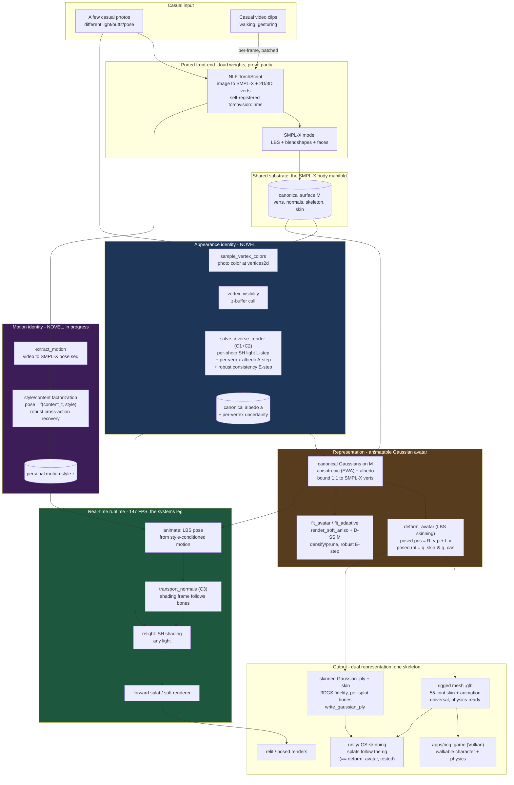

# NeuralCharGen — system architecture

**One-line:** casual photos + casual video → a hyperreal, **relightable**, **riggable**, **personally-animated**, game-engine-ready 3D avatar — built entirely in C++/CUDA (no Python at runtime), on novel, benchmarked math.

**The unifying principle (the thesis):** *personal identity — how you look and how you move — is the invariant latent that explains **mutually-inconsistent** casual observations across nuisance diversity.* The same observations vary in many nuisances at once — lighting, pose, camera, **outfit, occlusion, even other people in frame** — yet identity is the component common to all of them. Lighting diversity makes **appearance** (albedo) identifiable; action diversity makes **motion style** identifiable; and the *inconsistency itself* is not noise to average but structure to disentangle (identity vs nuisance). One principle, two manifolds (appearance & motion), one avatar — recovered from data too incoherent for any averaging method.

---

## 1. System diagram



ASCII fallback (data flow):

```
casual photos ─┐                                    ┌─ albedo (relightable)  ──┐
               ├─► NLF ─► SMPL-X ─► body manifold ──┤                           ├─► Gaussians/mesh
casual video ──┘    (ported front-end)              └─ motion style (personal) ─┘        │
                                                                                          ▼
                                       animate(LBS) ─► transport normals(C3) ─► relight(SH) ─► splat
                                                                                          │  147 FPS
                                                                                          ▼
                                                                    glTF (.glb) ─► Unity / Unreal
```

---

## 2. Module map (`ncg-*`)

| Module | Role | Key pieces |
|---|---|---|
| `ncg-core` | tensor/CUDA/log helpers, custom-kernel pattern | error/cuda checks, saxpy golden |
| `ncg-io` | image, **safetensors**, WeightMap, **npy** | zero-copy mmap, parity harness |
| `ncg-body` | image→SMPL-X | **NLF** (TorchScript loader + self-registered `nms`), SMPL-X LBS forward, faces |
| `ncg-recon` | **the novel core** | appearance (sample/visibility/fusion), adaptive scale, **inverse_render (C1/C2 + SH + relight + C3 transport)** |
| `ncg-runtime` | renderers + camera | forward-splat CUDA kernel, differentiable `render_soft`, **`render_soft_aniso` (anisotropic EWA)**, `solve_pinhole_camera` |
| `ncg-fit` | per-subject 3DGS + avatar | multi-view fit, `refine_gaussians_to_image`, **`fit_adaptive`** (densify/prune + D-SSIM), **`fit_avatar`/`deform_avatar`** (animatable, robust), `ssim` |
| `ncg-mesh` | mesh + export | marching cubes, normals, glTF write (static/skinned/animated), **`write_gaussian_ply`** (3DGS .ply + skinning sidecar) |
| `ncg-select` | bad-upload handling | sharpness + `select_views` (submodular coverage, leg #3) |
| `ncg-nerf` | NeRF leg + hybrid | TinyNerf, differentiable volume render, `composite_over` |
| `ncg-material`/`ncg-rig` | relight shader / rig export | analytical relight, OBJ+rig JSON |
| `ncg-record` | experiment recording | run dirs, metrics.jsonl, image dumps, timers, PSNR/SSIM/MAE |
| `apps/ncg_cli` | driver | `fit fuse delight relight export benchmark runtime nerf render turntable select` + **`avatar`** (train+export, `--identity`/`--densify`/`--robust`), **`style`** (C4) |
| `apps/ncg_game` | **native Vulkan game** | loads rigged `.glb`, skinned animation, floor, orbit cam, WASD + gravity |
| `unity/` | **engine GS-skinning** | `GaussianSplatSkin.compute` + `GaussianSplatRenderer.cs` + `SplatQuad.shader` (proven == `deform_avatar`) |
| `tools/` | DEV-only Python/shell | `convert_smplx`, `dump_nlf`, `extract_motion`, `make_avatar.sh`, **`best_shot.sh`** (coherent-segment mining) |

---

## 3. The three+1 contributions (where the novelty lives)

| | Claim | Validated |
|---|---|---|
| **C1** | casual multi-illumination ⇒ albedo identifiable; diversity helps | benchmark: 0.096→0.024 |
| **C2** | robust estimator rejects inconsistent/junk observations | 0.031 vs 0.096 (7× at 50%) |
| **C3** | animate∘relight = relight∘animate (normal transport) | error 4.2e-7 |
| **comparison** | relighting vs NeRF/3DGS (they bake light) | 6.2× better |
| **C4** | cross-action ⇒ **motion style** identifiable + robust from casual video | synthetic: 0.004 vs 0.58 |
| **C5 (new)** | **identity from incoherent observation** — a relightable identity recovered from mutually-inconsistent casual data by disentangling identity from per-frame nuisance | `avatar --identity` (C1/C2 driving the photoreal Gaussian avatar); garment-residual decomposition *proposed* |

**Why C5 is novel (and accurate).** Standard multi-view / inverse rendering assumes a *consistent* appearance; standard robust estimators assume a *dominant inlier mode*. Casual web data of one person has neither — outfit, era, lighting and even the framed person change across images, with no majority. C5's claim is that the **identity is still identifiable as the component that explains every observation under a per-frame illumination model**, while the rest is absorbed as per-frame nuisance. Implemented today: the robust multi-illumination solver (per-frame SH light L-step + shared albedo A-step + per-observation consistency E-step) supplies the avatar's appearance, so the consistent anchor (face/skin) yields a clean relightable identity while inconsistent observations (clothing-swap, occlusion, wrong person) are down-weighted per vertex. The naming is deliberate: we recover **who they are**, not a specific outfit that the data never agreed on — recovering an outfit absent from a consensus would be hallucination, not reconstruction.

Math + derivations: `docs/method.md` (§5 inverse rendering, §13 motion style, §14 identity-from-incoherent factorization). Numbers + stats: `docs/benchmarks.md`.

---

## 4. End-to-end pipeline (commands)

```bash
# photos -> rigged, textured, animated avatar (Unity-ready), one command:
tools/make_avatar.sh front.jpg side.jpg --out me.glb

# pieces:
ncg_cli fit       --image me.jpg --weights nlf --smplx smplx --refine   # 3DGS refine
ncg_cli fuse      --images a,b,c ...                                     # cross-photo fusion
ncg_cli delight   --images a,b,c ...                                     # recover albedo + relight
ncg_cli relight   --smplx smplx                                         # orbiting-light relight
ncg_cli export    --image me.jpg --weights nlf --smplx smplx --animate  # rigged+idle glTF
ncg_cli runtime   --smplx smplx [--motion m.npy]                        # 147 FPS animate+relight
ncg_cli benchmark --smplx smplx --seeds 5                               # paper figures
tools/extract_motion.py --frames dir --out m.npy                        # video -> SMPL-X motion

# animatable Gaussian avatar from a folder of frames -> dual export (mesh .glb + skinned .ply/.skin):
ncg_cli avatar  --frames dir --weights nlf --smplx smplx --motion m.npy --out-prefix me
ncg_cli avatar  --frames dir ... --identity 1     # C5: robust identity albedo from incoherent data
ncg_cli avatar  --frames dir ... --densify 1      # adaptive densification (face/hair detail)
ncg_cli style   --motions a,b,c --target a --out_motion styled.npy       # C4 motion-style transfer
tools/best_shot.sh video.mp4 frames/                                     # mine the longest coherent shot

# play it (machine with a display + Vulkan):
cmake -S apps/ncg_game -B build/game && cmake --build build/game && ./build/game/ncg_game --glb me.glb
```

---

## 5. Hardware / dev loop

Author on Mac (no CUDA) → push → build/run on **Jetstream2 H100 (sm_90)** → results back.
LibTorch = the torch 2.6 wheel (pre-cxx11-ABI). Full test suite: **49 green, 2 design-skips**.
Build-blind discipline: every kernel has a vs-LibTorch test; every claim has a benchmark.
