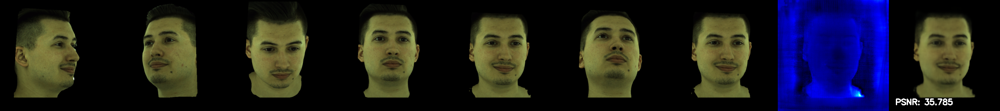

## Introduction
This project is implemented based on [FDNeRF](https://fdnerf.github.io/)


<video src="./assets/teaser.mp4" controls preload></video>

## Pipeline


## Installation
```
conda env create -f environment.yml
conda activate fdnerf
conda install pytorch==1.7.1 torchvision==0.8.2 torchaudio==0.7.2 cudatoolkit=11.0 -c pytorch
conda install pytorch torchvision torchaudio cudatoolkit=11.3 -c pytorch
pip install mmcv-full==1.3.9 -f https://download.openmmlab.com/mmcv/dist/cu110/torch1.7.0/index.html
```

There are some packages that are not included in the `environment.yml` file. Perhaps the author forgot about them. You can install them using the following command:
```bash
pip install skimage lpips openpyxl dlib imageio-ffmpeg
```

## Data Preparation
The preprocessing pipeline are avaliable in `src/data_process`.

To perform video2frame, please run the following command:
```bash
python ./src/data_process/video_preprocess.py
```

To perform landmark detection, please run the following command:
```bash
python -u ./src/data_process/Wild_data_preprocess.py \
    --datapath /scratch/network/hy4522/FDNeRF_data/kiwi/processed \
    --savepath /scratch/network/hy4522/FDNeRF_data/kiwi/exp_result \
    --resolution_tar 512 \
```

To convert the the dataset to the format used in FDNeRF, please run the following command:
```bash
python -u ./src/data_process/fdnerf_converter.py \
    --input_dir /scratch/network/hy4522/FDNeRF_data/Custom/exp_result \
    --output_dir /scratch/network/hy4522/FDNeRF_data/Custom_converted \
    --generate_3dmm \
```

If you wish to use full head data instead of facial landmark detection + pose estimation. You may use image with calibrated 3DMM parameters. And convert to the format used in FDNeRF.

## Training

Notice: The training process may require a lot of GPU memory. You may need to reduce the batch size and chunk size.

### train w/ semantic_window 
```bash
python train/train_fdnerf.py --resume --batch_size 8 --gpu_id 0 --datadir '[datasets path]' --dataset_prefix 'mixwild' --name '2Dimplicitdeform_reconstruct' --conf 'conf/exp/fp_mixexp_2D_implicit.conf' --chunk_size 4000
```

### train w/o semantic_window 
```bash
python train/train_fdnerf.py --semantic_window 27 --resume --batch_size 8 --gpu_id 0 --datadir '[datasets path]' --dataset_prefix 'mixwild' --name '2Dimplicitdeform_video' --conf 'conf/exp/fp_mixexp_2D_implicit_video.conf' --chunk_size 4000
```

## Video Generation

```bash
python train/train_fdnerf.py \
  --datadir /scratch/network/hy4522/FDNeRF_data/Custom_converted \
  --name 2Dimplicitdeform_inhomogeneous \
  --only_video \
  --gpu_id 0 \
  --pose_traj_video spiral \
  --num_video_frames 120 \
  --nview_test 4 \
  --resume \
  --checkpoints_path checkpoints
```

Two kinds of trajectory are supported: `spiral` and `standard`.
